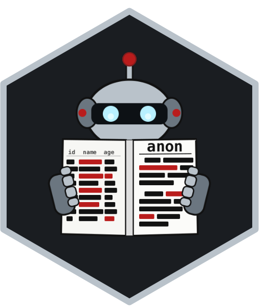

<!-- README.md is generated from README.Rmd. Please edit that file -->

# anon <a href="https://nash-delcamp-slp.github.io/anon/"></a>

<!-- badges: start -->

<!-- badges: end -->

The anon package provides comprehensive tools for anonymizing sensitive
information in R objects, including data frames, variable labels, lists,
and character/factor/numeric vectors.

## Installation

You can install the development version of anon from
[GitHub](https://github.com/) with:

``` r
# install.packages("pak")
pak::pak("nash-delcamp-slp/anon")
```

## Loading the Package

``` r
library(anon)
```

Example data:

``` r
library(dplyr)
#> 
#> Attaching package: 'dplyr'
#> The following objects are masked from 'package:stats':
#> 
#>     filter, lag
#> The following objects are masked from 'package:base':
#> 
#>     intersect, setdiff, setequal, union
data("starwars", package = "dplyr")

a_new_hope_intro <- c(
  "It is a period of civil war.", 
  "Rebel spaceships, striking from a hidden base, have won their first victory against the evil Galactic Empire.",
  "During the battle, Rebel spies managed to steal secret plans to the Empire's ultimate weapon, the DEATH STAR, an armored space station with enough power to destroy an entire planet.",
  "Pursued by the Empire's sinister agents, Princess Leia races home aboard her starship, custodian of the stolen plans that can save her people and restore freedom to the galaxy...."
)
```

## Core Anonymization with `anon()`

The main `anon()` function and helper `anon_*()` support anonymization
of various R objects.

### Vector Anonymization

``` r
# Character sequence anonymization - preserves unique mappings
names_vector <- c("John", "Paul", "John", "Keith")
anon_id_chr_sequence(names_vector)
#> [1] "ID 1" "ID 2" "ID 1" "ID 3"

# Numeric sequence anonymization
anon_id_num_sequence(starwars$name) |> 
  head()
#> [1] 1 2 3 4 5 6

# Preserve distribution while anonymizing values
anon_num_preserve_distribution(starwars$height) |> 
  head()
#> [1] 183.0 174.0 138.0  66.0 189.5 177.5

# Group numeric values into ranges
anon_num_range(starwars$mass, n_breaks = 10) |> 
  head()
#> [1] "[0,100)"   "[0,100)"   "[0,100)"   "[100,200)" "[0,100)"   "[100,200)"
```

### Data Frame Anonymization

``` r
anon_starwars <- starwars |> 
  anon(
    # Pattern-based text replacement
    pattern_list = list(
      DARK = c("empire", "imperials?", "sith"),
      LIGHT = c("jedi", "rebels?")
    ),
    # Column-specific anonymization rules
    df_variable_names = list(
      name = anon_id_chr_sequence,
      homeworld = ~ anon_id_chr_sequence(.x, start = "Planet ")
    ),
    # Class-based anonymization rules
    df_classes = list(
      integer = ~ anon_num_range(.x, n_breaks = 10),
      numeric = anon_num_preserve_distribution
    )
  )

glimpse(anon_starwars)
#> Rows: 87
#> Columns: 14
#> $ name       <chr> "ID 01", "ID 02", "ID 03", "ID 04", "ID 05", "ID 06", "ID 0~
#> $ height     <chr> "[160,180)", "[160,180)", "[80,100)", "[200,220)", "[140,16~
#> $ mass       <dbl> 88, 66, 57, 58, 136, 15, 66, 57, 80, 88, 80, NA, 77, 69, 90~
#> $ hair_color <chr> "blond", NA, NA, "none", "brown", "brown, grey", "brown", N~
#> $ skin_color <chr> "fair", "gold", "white, blue", "white", "light", "light", "~
#> $ eye_color  <chr> "blue", "yellow", "red", "yellow", "brown", "blue", "blue",~
#> $ birth_year <dbl> 35.5, 200.0, 31.5, 43.0, 35.5, 73.0, 600.0, NA, 54.0, 22.0,~
#> $ sex        <chr> "male", "none", "none", "male", "female", "male", "female",~
#> $ gender     <chr> "masculine", "masculine", "masculine", "masculine", "femini~
#> $ homeworld  <chr> "Planet 01", "Planet 01", "Planet 02", "Planet 01", "Planet~
#> $ species    <chr> "Human", "Droid", "Droid", "Human", "Human", "Human", "Huma~
#> $ films      <list> <"A New Hope", "The DARK Strikes Back", "Return of the LIG~
#> $ vehicles   <list> <"Snowspeeder", "DARK Speeder Bike">, <>, <>, <>, "DARK Sp~
#> $ starships  <list> <"X-wing", "DARK shuttle">, <>, <>, "TIE Advanced x1", <>,~
```

## Shiny App

`anon` includes a local Shiny app for reviewing the current R
environment, selecting objects for a report, cleaning text, and building
anonymized prompt context.

``` r
library(anon)
library(dplyr)

starwars <- dplyr::starwars
run_anon_app()
```

By default, the app loads the current environment into the inventory and
starts with all available objects selected for `Objects for report`. The
`Refresh environment` button is available if the session changes after
launch.

## Global Options System

Many functions in the anon package reference global `anon.*` options
that make it easy to configure default behaviors across workflows.

Use `anon_options()` as the central helper for these settings. It is a
thin wrapper around base `options()` for the supported anon package
options:

- `anon_options()` with no arguments returns the current supported
  `anon.*` values.
- `anon_options(...)` sets those same underlying global options and
  invisibly returns the previous values, matching the values returned by
  `options()`.
- `options(old)` can still be used to restore previously captured
  values.

You can still call `options()` directly, but the examples below use
`anon_options()` so all supported package options are configured in one
consistent way.

``` r
anon_options()
#> $anon.default_replacement
#> NULL
#> 
#> $anon.pattern_list
#> NULL
#> 
#> $anon.df_variable_names
#> NULL
#> 
#> $anon.df_classes
#> NULL
#> 
#> $anon.nlp_auto
#> NULL
#> 
#> $anon.nlp_default_replacements
#> NULL
#> 
#> $anon.example_values_n
#> NULL
#> 
#> $anon.example_rows
#> NULL
```

### Setting Default Patterns & Replacements

Set `pattern_list` to define patterns that should always be replaced.

``` r
anon_options(
  pattern_list = list(
    DARK = c("empire", "imperials?", "sith"),
    LIGHT = c("jedi", "rebels?")
  )
)
anon(a_new_hope_intro)
#> [1] "It is a period of civil war."                                                                                                                                                       
#> [2] "LIGHT spaceships, striking from a hidden base, have won their first victory against the evil Galactic DARK."                                                                        
#> [3] "During the battle, LIGHT spies managed to steal secret plans to the DARK's ultimate weapon, the DEATH STAR, an armored space station with enough power to destroy an entire planet."
#> [4] "Pursued by the DARK's sinister agents, Princess Leia races home aboard her starship, custodian of the stolen plans that can save her people and restore freedom to the galaxy...."
```

The default options are applied after provided arguments.

``` r
anon(
  a_new_hope_intro,
  pattern_list = list("good guy" = "rebel")
)
#> [1] "It is a period of civil war."                                                                                                                                                          
#> [2] "good guy spaceships, striking from a hidden base, have won their first victory against the evil Galactic DARK."                                                                        
#> [3] "During the battle, good guy spies managed to steal secret plans to the DARK's ultimate weapon, the DEATH STAR, an armored space station with enough power to destroy an entire planet."
#> [4] "Pursued by the DARK's sinister agents, Princess Leia races home aboard her starship, custodian of the stolen plans that can save her people and restore freedom to the galaxy...."
```

Reset the option:

``` r
anon_options(pattern_list = NULL)
```

### Setting Default Data Frame Behavior

Set `df_variable_names` and `df_classes` to automatically replace
content with a constant or the result of a function.

``` r
old_options <- anon_options(
  df_variable_names = list(
    name = anon_id_chr_sequence,
    homeworld = ~ anon_id_chr_sequence(.x, start = "Planet ")
  ),
  df_classes = list(
    integer = ~ anon_num_range(.x, n_breaks = 10),
    numeric = anon_num_preserve_distribution
  )
)

starwars |>
  anon() |>
  glimpse()
#> Rows: 87
#> Columns: 14
#> $ name       <chr> "ID 01", "ID 02", "ID 03", "ID 04", "ID 05", "ID 06", "ID 0~
#> $ height     <chr> "[160,180)", "[160,180)", "[80,100)", "[200,220)", "[140,16~
#> $ mass       <dbl> 113.0, 48.0, 82.0, 76.0, 40.0, 80.0, 48.0, 82.0, 85.0, 113.~
#> $ hair_color <chr> "blond", NA, NA, "none", "brown", "brown, grey", "brown", N~
#> $ skin_color <chr> "fair", "gold", "white, blue", "white", "light", "light", "~
#> $ eye_color  <chr> "blue", "yellow", "red", "yellow", "brown", "blue", "blue",~
#> $ birth_year <dbl> 53.50, 600.00, 52.00, 43.00, 53.50, 47.00, 112.00, NA, 52.0~
#> $ sex        <chr> "male", "none", "none", "male", "female", "male", "female",~
#> $ gender     <chr> "masculine", "masculine", "masculine", "masculine", "femini~
#> $ homeworld  <chr> "Planet 01", "Planet 01", "Planet 02", "Planet 01", "Planet~
#> $ species    <chr> "Human", "Droid", "Droid", "Human", "Human", "Human", "Huma~
#> $ films      <list> <"A New Hope", "The Empire Strikes Back", "Return of the J~
#> $ vehicles   <list> <"Snowspeeder", "Imperial Speeder Bike">, <>, <>, <>, "Imp~
#> $ starships  <list> <"X-wing", "Imperial shuttle">, <>, <>, "TIE Advanced x1",~
```

Reset the options:

``` r
old_options <- anon_options(
  df_variable_names = NULL,
  df_classes = NULL
)
```

### Setting a Default Replacement

Set `default_replacement` to define a fallback replacement.

``` r
old_options <- anon_options(default_replacement = "[HIDDEN]")

anon(
  a_new_hope_intro,
  pattern_list = list("empire", "imperials?", "sith", "jedi", "rebels?")
)
#> [1] "It is a period of civil war."                                                                                                                                                              
#> [2] "[HIDDEN] spaceships, striking from a hidden base, have won their first victory against the evil Galactic [HIDDEN]."                                                                        
#> [3] "During the battle, [HIDDEN] spies managed to steal secret plans to the [HIDDEN]'s ultimate weapon, the DEATH STAR, an armored space station with enough power to destroy an entire planet."
#> [4] "Pursued by the [HIDDEN]'s sinister agents, Princess Leia races home aboard her starship, custodian of the stolen plans that can save her people and restore freedom to the galaxy...."
```

Reset the option:

``` r
old_options <- anon_options(default_replacement = NULL)
```

### Setting Default NLP Entity Replacements

Set `nlp_default_replacements` to define replacement values for
different entity types. Use `nlp_default_replacements()` to create the
list input.

``` r
# View the default replacement values for all entity types
str(nlp_default_replacements())
#> List of 19
#>  $ cardinal   : chr "[CARDINAL]"
#>  $ date       : chr "[DATE]"
#>  $ event      : chr "[EVENT]"
#>  $ fac        : chr "[FAC]"
#>  $ gpe        : chr "[GPE]"
#>  $ language   : chr "[LANGUAGE]"
#>  $ law        : chr "[LAW]"
#>  $ loc        : chr "[LOC]"
#>  $ money      : chr "[MONEY]"
#>  $ norp       : chr "[NORP]"
#>  $ ordinal    : chr "[ORDINAL]"
#>  $ org        : chr "[ORG]"
#>  $ percent    : chr "[PERCENT]"
#>  $ person     : chr "[PERSON]"
#>  $ product    : chr "[PRODUCT]"
#>  $ quantity   : chr "[QUANTITY]"
#>  $ time       : chr "[TIME]"
#>  $ work_of_art: chr "[WORK_OF_ART]"
#>  $ propn      : chr "[PROPN]"

# Customize specific replacements
my_replacements <- nlp_default_replacements(
  person = "[NAME]",
  org = "[GROUP]",
  gpe = "[LOCATION]",
  propn = "[PROPER_NOUN]"
)

old_options <- anon_options(nlp_default_replacements = my_replacements)

anon_nlp_entities(a_new_hope_intro)
#> [1] "It is a period of civil war."                                                                                                                                                                       
#> [2] "[PROPER_NOUN] spaceships, striking from a hidden base, have won their [ORDINAL] victory against the evil [LOC]."                                                                                    
#> [3] "During the battle, [PROPER_NOUN] spies managed to steal secret plans to the [LOC]'s ultimate weapon, [GROUP], an armored space station with enough power to destroy an entire planet."              
#> [4] "Pursued by the [LOC]'s sinister agents, [PROPER_NOUN] [PROPER_NOUN] races home aboard her [GROUP]ship, custodian of the stolen plans that can save her people and restore freedom to the galaxy...."
```

Reset the option:

``` r
old_options <- anon_options(nlp_default_replacements = NULL)
```

### Enabling Automatic NLP Entity Anonymization

Set `nlp_auto` to control which entity types are automatically
anonymized. Use `nlp_auto()` to create the list input.

``` r
# View default auto-anonymization settings (all FALSE by default)
str(nlp_auto())
#> List of 19
#>  $ cardinal   : logi FALSE
#>  $ date       : logi FALSE
#>  $ event      : logi FALSE
#>  $ fac        : logi FALSE
#>  $ gpe        : logi FALSE
#>  $ language   : logi FALSE
#>  $ law        : logi FALSE
#>  $ loc        : logi FALSE
#>  $ money      : logi FALSE
#>  $ norp       : logi FALSE
#>  $ ordinal    : logi FALSE
#>  $ org        : logi FALSE
#>  $ percent    : logi FALSE
#>  $ person     : logi FALSE
#>  $ product    : logi FALSE
#>  $ quantity   : logi FALSE
#>  $ time       : logi FALSE
#>  $ work_of_art: logi FALSE
#>  $ propn      : logi FALSE

# Enable all entity types
str(nlp_auto(default = TRUE))
#> List of 19
#>  $ cardinal   : logi TRUE
#>  $ date       : logi TRUE
#>  $ event      : logi TRUE
#>  $ fac        : logi TRUE
#>  $ gpe        : logi TRUE
#>  $ language   : logi TRUE
#>  $ law        : logi TRUE
#>  $ loc        : logi TRUE
#>  $ money      : logi TRUE
#>  $ norp       : logi TRUE
#>  $ ordinal    : logi TRUE
#>  $ org        : logi TRUE
#>  $ percent    : logi TRUE
#>  $ person     : logi TRUE
#>  $ product    : logi TRUE
#>  $ quantity   : logi TRUE
#>  $ time       : logi TRUE
#>  $ work_of_art: logi TRUE
#>  $ propn      : logi TRUE

# Enable only specific entity types
my_auto_settings <- nlp_auto(person = TRUE, org = TRUE, gpe = TRUE, propn = TRUE)
old_options <- anon_options(nlp_auto = my_auto_settings)

anon(a_new_hope_intro)
#> [1] "It is a period of civil war."                                                                                                                                                           
#> [2] "[PROPN] spaceships, striking from a hidden base, have won their first victory against the evil [PROPN] [PROPN]."                                                                        
#> [3] "During the battle, [PROPN] spies managed to steal secret plans to the [PROPN]'s ultimate weapon, [ORG], an armored space station with enough power to destroy an entire planet."        
#> [4] "Pursued by the [PROPN]'s sinister agents, [PROPN] [PROPN] races home aboard her [ORG]ship, custodian of the stolen plans that can save her people and restore freedom to the galaxy...."
```

Reset the option:

``` r
old_options <- anon_options(nlp_auto = NULL)
```

### Setting Default Data Summary Examples

Set `example_values_n` and `example_rows` to control the default example
content used by `anon_data_summary()`, `anon_report()`, and the Shiny
app’s initial data-summary settings. Use `anon_example_rows()` to create
the row-example specification.

``` r
old_options <- anon_options(
  example_values_n = 3,
  example_rows = anon_example_rows(
    n = 2,
    key = "homeworld",
    method = "random",
    n_key_values = 2,
    seed = 11
  )
)

anon_data_summary(list(starwars = starwars))
#> Environment Data Summary
#> ========================
#> 
#>   total_objects data_frames other_objects total_memory
#> 1             1           1             0        57440
#> 
#> Data Frames:
#> ------------
#>       name       type n_rows n_cols memory_size
#> 1 starwars data.frame     87     14     56.1 Kb
#> 
#> 
#> Variable Details (starwars):
#> 
#> -------------------------- 
#>      variable data_type n_distinct n_missing n_total pct_missing label
#> 1        name character         87         0      87        0.00  <NA>
#> 2      height   integer         45         6      87        6.90  <NA>
#> 3        mass   numeric         38        28      87       32.18  <NA>
#> 4  hair_color character         11         5      87        5.75  <NA>
#> 5  skin_color character         31         0      87        0.00  <NA>
#> 6   eye_color character         15         0      87        0.00  <NA>
#> 7  birth_year   numeric         36        44      87       50.57  <NA>
#> 8         sex character          4         4      87        4.60  <NA>
#> 9      gender character          2         4      87        4.60  <NA>
#> 10  homeworld character         48        10      87       11.49  <NA>
#> 11    species character         37         4      87        4.60  <NA>
#> 12      films      list         24         0      87        0.00  <NA>
#> 13   vehicles      list         11         0      87        0.00  <NA>
#> 14  starships      list         16         0      87        0.00  <NA>
#>                    example_values
#> 1  Luke Skywalker | C-3PO | R2-D2
#> 2                                
#> 3                                
#> 4            blond | none | brown
#> 5       fair | gold | white, blue
#> 6             blue | yellow | red
#> 7                                
#> 8            male | none | female
#> 9            masculine | feminine
#> 10    Tatooine | Naboo | Alderaan
#> 11        Human | Droid | Wookiee
#> 12                               
#> 13                               
#> 14                               
#> 
#> 
#> Example Scenario 1 (homeworld = Aleen Minor): 
#> --------------------------------------------- 
#> 
#> starwars:
#>           name height mass hair_color skin_color eye_color birth_year  sex
#> 1 Ratts Tyerel     79   15       none grey, blue   unknown         NA male
#>      gender   homeworld species              films vehicles starships
#> 1 masculine Aleen Minor  Aleena The Phantom Menace                   
#> 
#> Example Scenario 2 (homeworld = Quermia): 
#> ----------------------------------------- 
#> 
#> starwars:
#>          name height mass hair_color skin_color eye_color birth_year  sex
#> 1 Yarael Poof    264   NA       none      white    yellow         NA male
#>      gender homeworld  species              films vehicles starships
#> 1 masculine   Quermia Quermian The Phantom Menace
```

Reset the options:

``` r
old_options <- anon_options(
  example_values_n = NULL,
  example_rows = NULL
)
```

## Automatic NLP-Powered Anonymization

The anon package includes powerful NLP functions that can automatically
detect and anonymize different types of named entities in text.

### Individual NLP Functions

The package provides specific functions for different entity types:

- `anon_nlp_entities()`: Detect and anonymize select entities. By
  default, all entities.
- `anon_nlp_people()`: Detect and anonymize person names
- `anon_nlp_organizations()`: Detect and anonymize organization names
- `anon_nlp_places()`: Detect and anonymize locations (cities,
  countries, etc.)
- `anon_nlp_dates()`: Detect and anonymize dates
- `anon_nlp_numbers()`: Detect and anonymize monetary amounts and
  percentages

``` r
anon_nlp_entities(a_new_hope_intro)
#> [1] "It is a period of civil war."                                                                                                                                                         
#> [2] "[PROPN] spaceships, striking from a hidden base, have won their [ORDINAL] victory against the evil [LOC]."                                                                            
#> [3] "During the battle, [PROPN] spies managed to steal secret plans to the [LOC]'s ultimate weapon, [ORG], an armored space station with enough power to destroy an entire planet."        
#> [4] "Pursued by the [LOC]'s sinister agents, [PROPN] [PROPN] races home aboard her [ORG]ship, custodian of the stolen plans that can save her people and restore freedom to the galaxy...."
anon_nlp_people(a_new_hope_intro)
#> [1] "It is a period of civil war."                                                                                                                                                         
#> [2] "Rebel spaceships, striking from a hidden base, have won their first victory against the evil Galactic Empire."                                                                        
#> [3] "During the battle, Rebel spies managed to steal secret plans to the Empire's ultimate weapon, the DEATH STAR, an armored space station with enough power to destroy an entire planet."
#> [4] "Pursued by the Empire's sinister agents, Princess Leia races home aboard her starship, custodian of the stolen plans that can save her people and restore freedom to the galaxy...."
anon_nlp_organizations(a_new_hope_intro)
#> [1] "It is a period of civil war."                                                                                                                                                        
#> [2] "Rebel spaceships, striking from a hidden base, have won their first victory against the evil Galactic Empire."                                                                       
#> [3] "During the battle, Rebel spies managed to steal secret plans to the Empire's ultimate weapon, [ORG], an armored space station with enough power to destroy an entire planet."        
#> [4] "Pursued by the Empire's sinister agents, Princess Leia races home aboard her [ORG]ship, custodian of the stolen plans that can save her people and restore freedom to the galaxy...."
anon_nlp_places(a_new_hope_intro)
#> [1] "It is a period of civil war."                                                                                                                                                        
#> [2] "Rebel spaceships, striking from a hidden base, have won their first victory against the evil [LOC]."                                                                                 
#> [3] "During the battle, Rebel spies managed to steal secret plans to the [LOC]'s ultimate weapon, the DEATH STAR, an armored space station with enough power to destroy an entire planet."
#> [4] "Pursued by the [LOC]'s sinister agents, Princess Leia races home aboard her starship, custodian of the stolen plans that can save her people and restore freedom to the galaxy...."
anon_nlp_dates(a_new_hope_intro)
#> [1] "It is a period of civil war."                                                                                                                                                         
#> [2] "Rebel spaceships, striking from a hidden base, have won their first victory against the evil Galactic Empire."                                                                        
#> [3] "During the battle, Rebel spies managed to steal secret plans to the Empire's ultimate weapon, the DEATH STAR, an armored space station with enough power to destroy an entire planet."
#> [4] "Pursued by the Empire's sinister agents, Princess Leia races home aboard her starship, custodian of the stolen plans that can save her people and restore freedom to the galaxy...."
anon_nlp_numbers(a_new_hope_intro)
#> [1] "It is a period of civil war."                                                                                                                                                         
#> [2] "Rebel spaceships, striking from a hidden base, have won their [ORDINAL] victory against the evil Galactic Empire."                                                                    
#> [3] "During the battle, Rebel spies managed to steal secret plans to the Empire's ultimate weapon, the DEATH STAR, an armored space station with enough power to destroy an entire planet."
#> [4] "Pursued by the Empire's sinister agents, Princess Leia races home aboard her starship, custodian of the stolen plans that can save her people and restore freedom to the galaxy...."
```

## Data Environment Summary

The `anon_data_summary()` function provides an anonymized overview of
the data in your environment:

``` r
anon_data_summary()
#> Environment Data Summary
#> ========================
#> 
#>   total_objects data_frames other_objects total_memory
#> 1             1           1             0        57440
#> 
#> Data Frames:
#> ------------
#>       name       type n_rows n_cols memory_size
#> 1 starwars data.frame     87     14     56.1 Kb
#> 
#> 
#> Variable Details (starwars):
#> 
#> -------------------------- 
#>      variable data_type n_distinct n_missing n_total pct_missing label
#> 1        name character         87         0      87        0.00  <NA>
#> 2      height   integer         45         6      87        6.90  <NA>
#> 3        mass   numeric         38        28      87       32.18  <NA>
#> 4  hair_color character         11         5      87        5.75  <NA>
#> 5  skin_color character         31         0      87        0.00  <NA>
#> 6   eye_color character         15         0      87        0.00  <NA>
#> 7  birth_year   numeric         36        44      87       50.57  <NA>
#> 8         sex character          4         4      87        4.60  <NA>
#> 9      gender character          2         4      87        4.60  <NA>
#> 10  homeworld character         48        10      87       11.49  <NA>
#> 11    species character         37         4      87        4.60  <NA>
#> 12      films      list         24         0      87        0.00  <NA>
#> 13   vehicles      list         11         0      87        0.00  <NA>
#> 14  starships      list         16         0      87        0.00  <NA>
```

## Pattern Detection Warnings

When using pattern-based anonymization, anon can detect potential
approximate matches and report warnings. This is off by default; enable
it with `check_approximate = TRUE` or globally with
`options(anon.check_approximate = TRUE)`.

``` r
starwars |>
  anon(list(
    "blonde", "bleu", "imperials"
  ), check_approximate = TRUE) |>
  glimpse()
#> Warning: Potential approximate match: 'blond' is similar to pattern 'blonde'
#> * Potential approximate match: 'blue' is similar to pattern 'bleu'
#> * Potential approximate match: 'Imperial Speeder Bike' is similar to pattern 'imperials'
#> * Potential approximate match: 'Imperial shuttle' is similar to pattern 'imperials'
#> Rows: 87
#> Columns: 14
#> $ name       <chr> "Luke Skywalker", "C-3PO", "R2-D2", "Darth Vader", "Leia Or~
#> $ height     <int> 172, 167, 96, 202, 150, 178, 165, 97, 183, 182, 188, 180, 2~
#> $ mass       <dbl> 77.0, 75.0, 32.0, 136.0, 49.0, 120.0, 75.0, 32.0, 84.0, 77.~
#> $ hair_color <chr> "blond", NA, NA, "none", "brown", "brown, grey", "brown", N~
#> $ skin_color <chr> "fair", "gold", "white, blue", "white", "light", "light", "~
#> $ eye_color  <chr> "blue", "yellow", "red", "yellow", "brown", "blue", "blue",~
#> $ birth_year <dbl> 19.0, 112.0, 33.0, 41.9, 19.0, 52.0, 47.0, NA, 24.0, 57.0, ~
#> $ sex        <chr> "male", "none", "none", "male", "female", "male", "female",~
#> $ gender     <chr> "masculine", "masculine", "masculine", "masculine", "femini~
#> $ homeworld  <chr> "Tatooine", "Tatooine", "Naboo", "Tatooine", "Alderaan", "T~
#> $ species    <chr> "Human", "Droid", "Droid", "Human", "Human", "Human", "Huma~
#> $ films      <list> <"A New Hope", "The Empire Strikes Back", "Return of the J~
#> $ vehicles   <list> <"Snowspeeder", "Imperial Speeder Bike">, <>, <>, <>, "Imp~
#> $ starships  <list> <"X-wing", "Imperial shuttle">, <>, <>, "TIE Advanced x1",~
```
